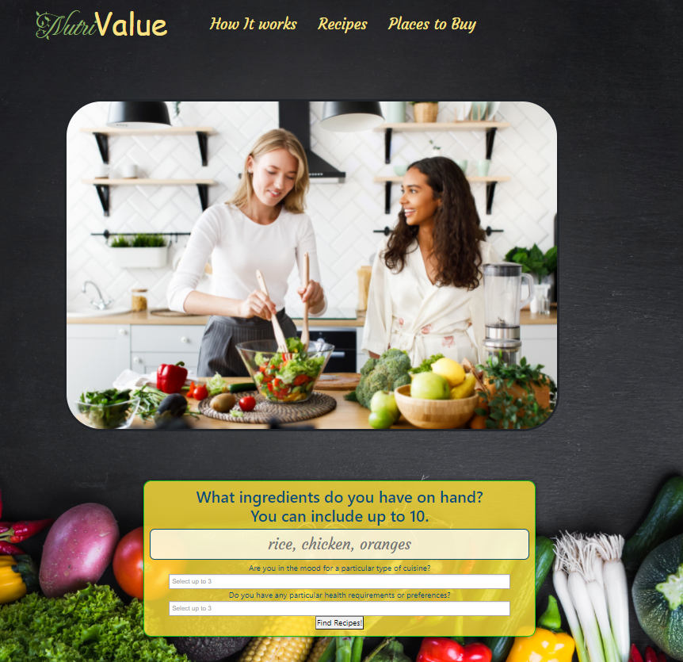

# Nutrition-Sustenance-Value
Group project. Hopefully merging will not cause conflicts. Github pages should still be able to do fetch requests.

* The URL of the deployed application: https://azuryte5.github.io/Nutrition-Sustenance-Value/

* The URL of the GitHub repository: https://github.com/azuryte5/Nutrition-Sustenance-Value

As an individual interested in healthy eating with a busy lifestyle,

I want an app that generates recipes that are convenient to make with what is available in the fridge while still having a balanced meal. 
The app should be quick to make, twenty minutes or less and made from ten ingredients are less. 
In case there is missing ingredients, the app should redirect to the nearest grocery.
The app is inclusive of all various types of cuisines.
When the list of recipes load, an image will appear on the app so I can get an idea of what I am making.

So that I can reduce food waste, while avoiding unhealthy fast food chains and acquiring all essential nutrients for my body.
